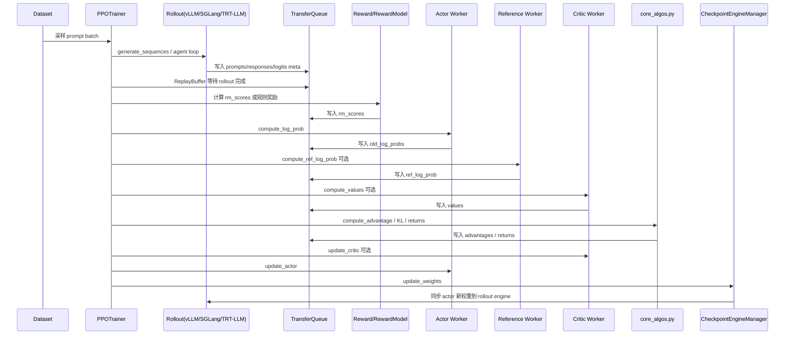

# verl 源码架构图解

本文用一张总览图概括 `docs/verl_code_architecture_cn.md` 中的核心内容。图里的每个模块都对应 `D:\learnAI\verl\verl` 下的源码目录或关键类。

## 总体架构图

```mermaid
flowchart TD
    User[用户/实验脚本<br/>torchrun / python -m verl.trainer.*] --> Hydra[Hydra 配置系统<br/>ppo_trainer.yaml / sft_trainer_engine.yaml]

    Hydra --> TaskRunner[TaskRunner<br/>Ray remote controller 启动器]
    TaskRunner --> PPOTrainer[PPOTrainer<br/>RLHF/PPO/GRPO 主控制器]
    TaskRunner --> SFTTrainer[SFTTrainer<br/>监督微调控制器]

    subgraph DataLayer[数据与协议层]
        Dataset[Dataset<br/>RLHFDataset / MultiTurnSFTDataset / RMDataset]
        DataProto[DataProto / TensorDict / BatchData<br/>tensor + non_tensor + meta_info]
        TQ[TransferQueue<br/>KV 数据流 / zero-copy / ReplayBuffer]
    end

    Dataset --> PPOTrainer
    Dataset --> SFTTrainer
    PPOTrainer <--> DataProto
    PPOTrainer <--> TQ
    SFTTrainer <--> DataProto

    subgraph ControllerLayer[single_controller 调度层]
        Register[@register<br/>声明 dispatch / execute / blocking]
        WorkerGroup[RayWorkerGroup<br/>把远程 worker 方法代理成本地调用]
        ResourcePool[ResourcePool<br/>GPU / placement group 管理]
        Colocated[Colocated Worker<br/>多角色共进程/共资源池]
    end

    PPOTrainer --> Register
    Register --> WorkerGroup
    PPOTrainer --> ResourcePool
    WorkerGroup --> Colocated

    subgraph RoleLayer[Worker 角色层]
        ARRW[ActorRolloutRefWorker<br/>actor + rollout + ref + checkpoint engine]
        Actor[Actor TrainingWorker<br/>策略模型训练与 logprob]
        Ref[Reference TrainingWorker<br/>参考策略 logprob / KL]
        Critic[Critic TrainingWorker<br/>value model / returns baseline]
        Reward[Reward Model / Reward Manager<br/>模型奖励 / 规则奖励 / reward loop]
        Teacher[Teacher Worker<br/>distillation 可选]
        TrainWorker[TrainingWorker<br/>通用模型训练/推理 worker]
    end

    WorkerGroup --> ARRW
    WorkerGroup --> Critic
    WorkerGroup --> Reward
    WorkerGroup --> Teacher
    ARRW --> Actor
    ARRW --> Ref
    Actor --> TrainWorker
    Ref --> TrainWorker
    Critic --> TrainWorker
    Reward --> TrainWorker
    Teacher --> TrainWorker

    subgraph EngineLayer[训练 Engine 层]
        BaseEngine[BaseEngine<br/>统一训练后端接口]
        FSDP[FSDP / FSDP2 Engine<br/>PyTorch FSDP 封装]
        Megatron[Megatron Engine<br/>MCore / TP / PP / CP / EP]
        VeOmni[VeOmni Engine]
        TorchTitan[TorchTitan Engine]
        Automodel[Automodel Engine]
        Losses[workers/utils/losses.py<br/>ppo_loss / value_loss / sft_loss]
    end

    TrainWorker --> BaseEngine
    TrainWorker --> Losses
    BaseEngine --> FSDP
    BaseEngine --> Megatron
    BaseEngine --> VeOmni
    BaseEngine --> TorchTitan
    BaseEngine --> Automodel

    subgraph RolloutLayer[Rollout 推理层]
        BaseRollout[BaseRollout<br/>resume / update_weights / release / generate]
        Replica[RolloutReplica<br/>HYBRID / COLOCATED / STANDALONE]
        VLLM[vLLM ServerAdapter]
        SGLang[SGLang ServerAdapter]
        TRTLLM[TRT-LLM ServerAdapter]
    end

    ARRW --> BaseRollout
    BaseRollout --> Replica
    Replica --> VLLM
    Replica --> SGLang
    Replica --> TRTLLM

    subgraph AlgoLayer[算法层]
        CoreAlgos[core_algos.py<br/>advantage estimator / policy loss / KL / value loss]
        Adv[Advantage<br/>GAE / GRPO / RLOO / ReMax / OPO / GPG / OTB / GDPO]
        PolicyLoss[Policy Loss<br/>vanilla PPO / GSPO / SAPO / CISPO / Clip-Cov / KL-Cov]
        KL[KL Controller / KL Penalty]
    end

    PPOTrainer --> CoreAlgos
    CoreAlgos --> Adv
    CoreAlgos --> PolicyLoss
    CoreAlgos --> KL
    Losses --> PolicyLoss

    subgraph CheckpointLayer[权重同步与 checkpoint 层]
        CKPTManager[CheckpointEngineManager<br/>协调 actor -> rollout 权重同步]
        CKPT[CheckpointEngine<br/>naive / NCCL / NIXL 等传输后端]
        TrainCKPT[utils/checkpoint<br/>训练 checkpoint 保存恢复]
    end

    ARRW --> CKPTManager
    CKPTManager --> CKPT
    BaseEngine --> TrainCKPT
    CKPTManager --> BaseRollout

    PPOTrainer -->|step 数据流| RolloutFlow[rollout 生成 response]
    RolloutFlow --> RewardFlow[reward / rm_scores]
    RewardFlow --> LogprobFlow[old_log_probs / ref_log_prob / values]
    LogprobFlow --> AdvFlow[advantages / returns]
    AdvFlow --> UpdateFlow[critic update / actor update]
    UpdateFlow --> SyncFlow[actor weights -> rollout]
    SyncFlow --> PPOTrainer
```

## 一次 PPO/GRPO 训练 step 的数据流



## 模块说明

| 模块 | 目的 | 作用 |
| --- | --- | --- |
| Hydra 配置系统 | 把算法、模型、后端、资源和数据路径组合起来 | 通过 `ppo_trainer.yaml`、`sft_trainer_engine.yaml` 等配置决定使用 PPO/GRPO、FSDP/Megatron、vLLM/SGLang、是否启用 critic/ref/reward model。 |
| `TaskRunner` | 在 Ray remote 进程中启动 trainer | 避免把重型 controller 放在 Ray head 进程里, 负责解析配置、注册角色、创建资源池、启动 `PPOTrainer` 或 `SFTTrainer`。 |
| `PPOTrainer` | RLHF 主控制器 | 描述算法级数据流: rollout、reward、old logprob、ref logprob、value、advantage、critic update、actor update、权重同步、validation、checkpoint。 |
| `SFTTrainer` | SFT 主控制器 | 用更简单的 SPMD 流程做监督微调, 复用 `TrainingWorker` 和 engine, 但不需要 rollout、reward、advantage 和多角色 Ray worker group。 |
| Dataset 层 | 把 parquet/jsonl 等数据转成训练需要的 prompt/response/mask | `RLHFDataset` 处理 RLHF prompt、reward_model ground truth、extra_info; `MultiTurnSFTDataset` 处理多轮 SFT 和 loss mask; `RMDataset` 可处理 chosen/rejected。 |
| `DataProto` / `TensorDict` / `BatchData` | 控制器和 worker 之间的数据协议 | 保存 tensor batch、非 tensor 信息和 meta 信息; 支持 chunk、concat、future 化; 当前同步 PPO 还会和 TransferQueue 结合使用。 |
| TransferQueue / ReplayBuffer | 高性能数据流和异步样本收集 | rollout 结果写入 KV 存储, trainer 只传 metadata/key, 减少大 tensor 在 controller 和 worker 间反复搬运。 |
| `single_controller` | 让 controller 像调用本地函数一样调用远程 worker | `@register` 声明 dispatch/collect/execute 策略; `RayWorkerGroup` 负责远程方法代理; `ResourcePool` 管理 GPU placement group。 |
| `ActorRolloutRefWorker` | actor、rollout、ref 的混合 worker | 根据 role 组合 actor `TrainingWorker`、rollout `BaseRollout`、ref `TrainingWorker` 和 checkpoint engine, 方便 on-policy 训练后立即同步权重给 rollout。 |
| `TrainingWorker` | 通用训练/推理 worker | 封装模型 engine、optimizer、scheduler、loss_fn、profiler、checkpoint; actor、critic、ref、reward、teacher、SFT 都可复用。 |
| `BaseEngine` / `EngineRegistry` | 隔离训练后端差异 | 定义统一接口: initialize、train_batch、infer_batch、forward_backward、save/load checkpoint、导出参数; 具体后端通过 registry 注册。 |
| FSDP/Megatron/VeOmni/TorchTitan/Automodel Engine | 实际训练后端适配 | 不重写底层分布式框架, 而是在 PyTorch FSDP、Megatron Core 等之上适配 verl 的 batch、loss、checkpoint、offload、LoRA、权重导出。 |
| `BaseRollout` / `RolloutReplica` | 统一推理服务接口 | 抽象 rollout 的生命周期: 启动服务、生成 response、释放/恢复 weights 和 KV cache、接收 actor 新权重。 |
| vLLM/SGLang/TRT-LLM Adapter | 高吞吐 rollout 生成 | 直接使用原始推理框架的核心能力, verl 负责 server adapter、Ray actor 管理、权重热更新、cache 管理、profiling、colocation/standalone 部署。 |
| Reward Manager / Reward Model | 给 rollout response 打分 | 支持规则奖励、判别式 reward model、生成式 reward model、hybrid reward; 输出 `rm_scores` 给算法层。 |
| `core_algos.py` | PPO-like 算法核心 | 注册并实现 advantage estimator、policy loss、KL penalty、value loss; trainer 只按配置名调度算法函数。 |
| `workers/utils/losses.py` | worker 内 loss 接入点 | `ppo_loss()` 调 policy loss registry; `value_loss()` 调 clipped value loss; `sft_loss()` 做监督学习 token loss。 |
| `CheckpointEngineManager` | actor 到 rollout 的权重同步 | actor update 后把训练权重同步到 rollout engine; naive colocated 场景可直接更新, 非 naive 场景可走 NCCL/NIXL 等传输。 |
| `utils/checkpoint` | 训练 checkpoint 保存恢复 | 保存/恢复模型、优化器、scheduler、dataloader 等训练状态。 |

## 为什么要这样分层

verl 把系统拆成这些层, 是为了让不同变化点互不污染:

- 换算法: 主要改 `core_algos.py` 中的 advantage estimator 或 policy loss。
- 换训练后端: 主要实现或选择一个 `BaseEngine` 子类。
- 换推理后端: 主要选择或实现 `BaseRollout` / `RolloutReplica` adapter。
- 换奖励方式: 主要改 reward manager、reward model 或 custom reward function。
- 换资源放置: 主要调 `ResourcePool`、colocated worker、reward model standalone/colocated 配置。
- 换数据流优化: 从传统 `DataProto` 到 TransferQueue, 不需要重写算法公式。

因此, 读源码时最重要的主链是:

```text
PPOTrainer.step()
  -> rollout 生成
  -> reward
  -> actor/ref/critic inference
  -> core_algos 计算 advantage
  -> workers/utils/losses.py 计算 loss
  -> TrainingWorker
  -> BaseEngine
  -> 具体 FSDP/Megatron/...
  -> CheckpointEngineManager 同步 actor 权重到 rollout
```

只要这条链路清楚, 后续阅读任意算法、后端或推理框架, 都是在这条链上替换一个节点。
